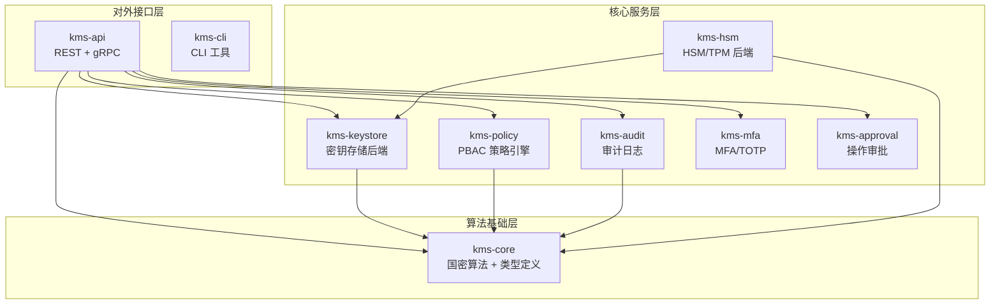
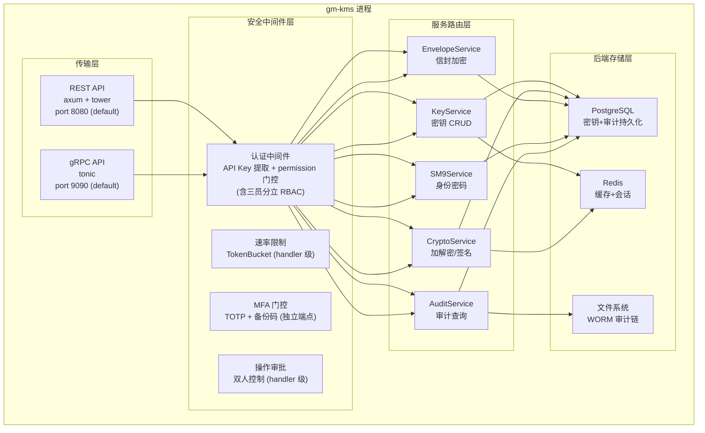
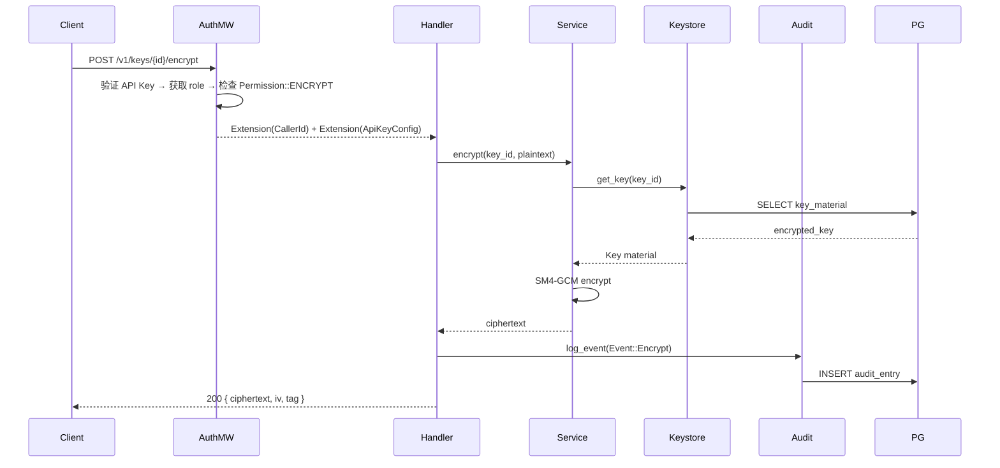
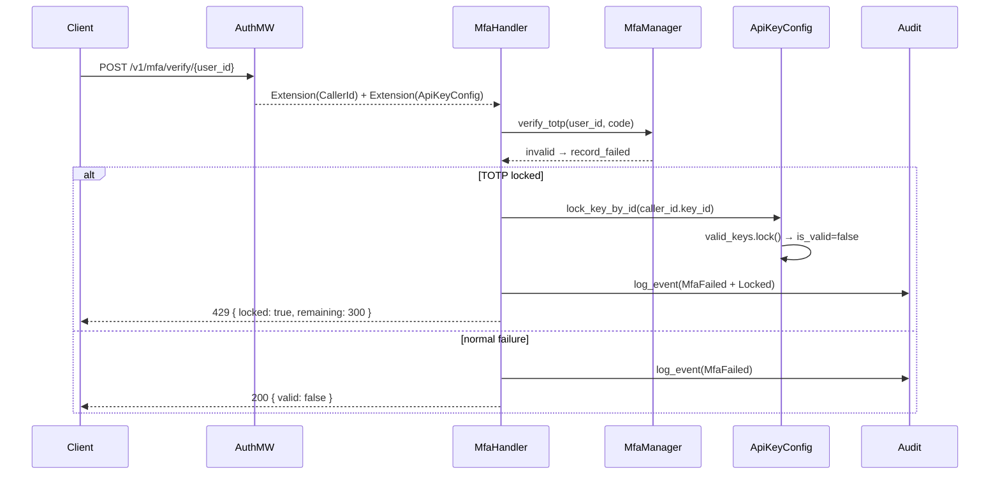

# GM-KMS 系统架构文档

> **版本**: v0.1.0  |  **日期**: 2026-06-28  |  **Rust Edition**: 2024

---

## 1. 项目概述

GM-KMS（国密密钥管理服务）是基于 Rust 构建的符合 GM/T 国家密码标准的密钥管理系统。提供密钥全生命周期管理、加密/解密、签名/验证、信封加密、SM9 基于身份密码、MFA 多因素认证、审计追踪、三员分立权限模型等核心能力。

### 1.1 核心能力矩阵

| 能力域 | 支持算法 | 标准依据 |
|--------|---------|---------|
| 对称加密 | SM4-CBC/GCM, AES-256-GCM | GM/T 0002-2012 |
| 非对称签名 | SM2, Ed25519, Ed448, EC-DSA(P-256/P-384) | GM/T 0003-2012 |
| 非对称加密 | SM2, RSA-4096 (OAEP) | GM/T 0003-2012 |
| 哈希 | SM3, SHA-256/384/512 | GM/T 0004-2012 |
| 身份密码 | SM9 签名/加密/密钥交换 | GM/T 0044-2016 |
| 密钥派生 | SM2-KEX, ECDH, SM9-KEX | GM/T 0044.3-2016 |
| 信封加密 | DEK-AES-256-GCM + KEK-wrap | NIST SP 800-57 |
| 密钥轮换 | SM9 主密钥、数据密钥、KEK | — |
| 密钥分享 | Shamir Secret Sharing (t-of-n) | — |

---

## 2. 系统架构

### 2.1 Crate 依赖图



### 2.2 进程架构



---

## 3. Crate 详细设计

### 3.1 kms-core — 算法基础层

**职责**: 国密算法实现、密钥类型定义、密码原语、信封加密、密钥轮换、Shamir 分享

```
kms-core/src/
├── algorithms.rs        # 加密敏捷性 trait 定义 (Sm2Crypto, Sm9Crypto 等)
├── algorithms_impl.rs   # SoftwareCryptoProvider 实现
├── backup.rs            # 密钥备份/恢复
├── csprng.rs            # 密码安全随机数
├── dh.rs                # ECDH / SM2-KEX 密钥派生
├── envelope.rs          # DEK-KEK 信封加密 (AES-256-GCM)
├── error.rs             # 统一错误类型
├── event.rs             # 审计事件模型
├── hybrid_kem.rs        # 混合密钥封装
├── key.rs               # 密钥结构 (KeyMetadata 等)
├── key_io.rs            # 密钥导入导出格式
├── memory_protection.rs # 内存清零 (Zeroizing)
├── policy.rs            # 权限常量定义
├── sanitize.rs          # 输入安全清洗
├── secret_rotation.rs   # 密钥轮换逻辑
├── self_test.rs         # KAT 自检 (SM2/SM3/SM4/SM9)
├── shamir.rs            # Shamir Secret Sharing
├── sm9_key_rotation.rs  # SM9 主密钥轮换
├── sm9_master_key.rs    # SM9 主密钥管理
├── tls_config.rs        # TLS 配置
├── types.rs             # 核心类型 (KeyId, TenantId 等)
└── webhook.rs           # Webhook 通知
```

**关键 trait**:
```rust
// 加密敏捷性 — 双后端切换
pub trait EncryptionAlgorithm: Send + Sync {
    fn algorithm(&self) -> Algorithm;
    fn encrypt(&self, key: &Key, plaintext: &[u8]) -> Result<Vec<u8>>;
    fn decrypt(&self, key: &Key, ciphertext: &[u8]) -> Result<Vec<u8>>;
}
```

### 3.2 kms-keystore — 密钥存储后端

**职责**: 密钥持久化、缓存、多后端抽象

```
kms-keystore/src/
├── backend.rs           # KeystoreBackend trait + 装饰器
├── cache.rs             # RedisCachedKeystore (L1 缓存)
├── postgres.rs          # PostgresKeystore (L2 持久化)
├── rate_limiter.rs      # CA 签发速率限制
├── repository.rs        # KeyStoreRepository trait
├── sm2_kex_session.rs   # SM2-KEX 会话管理
├── sm9_master_key.rs    # SM9 主密钥 PG 存储
├── software/            # SoftwareKeystore (内存后端)
│   ├── mod.rs           # 主逻辑 (~1467 行)
│   └── tests.rs         # 测试 (~1402 行)
└── validation.rs        # 密钥输入验证
```

**后端优先级**: `RedisCachedKeystore → PostgresKeystore → SoftwareKeystore (fallback)`

```
hot-path: Redis(L1) hit → direct return
miss:     Redis(L1) miss → PG(L2) lookup → populate L1
fallback: PG unavailable → SoftwareKeystore (ephemeral)
```

### 3.3 kms-policy — PBAC 策略引擎

**职责**: 基于属性的访问控制（Policy-Based Access Control）

```
kms-policy/src/
├── engine.rs   # 策略评估引擎 (glob_match, 属性匹配)
└── lib.rs      # Policy 数据结构定义
```

**五角色三员分立模型**:
| 角色 | 权限位掩码 | 说明 |
|------|-----------|------|
| ReadOnly | LIST_KEYS, GET_KEY | 只读查询 |
| Operator | + ENCRYPT/DECRYPT/SIGN/VERIFY/HASH/DH_DERIVE | 日常加密操作 |
| KeyAdmin | + CREATE_KEY/DELETE_KEY/ROTATE_KEY/IMPORT_KEY/EXPORT_KEY | 系统管理员 (密钥生命周期) |
| SecurityOfficer | VIEW_AUDIT, MANAGE_POLICY, MANAGE_API_KEYS, MANAGE_MFA, APPROVE_ACTION | 安全管理员 (审批/审计/策略) |
| AuditAdmin | VIEW_AUDIT, EXPORT_AUDIT | 审计管理员 (审计查询导出) |

三员分立映射: KeyAdmin (系统管理员) / SecurityOfficer (安全管理员) / AuditAdmin (审计管理员)。
Operator 和 ReadOnly 为操作级角色，无管理权限。每个 API Key 绑定单一角色，权限通过位掩码 `Permission` 枚举实现。

### 3.4 kms-audit — 审计日志

**职责**: WORM (Write-Once-Read-Many) 审计链、链验证、S3 归档

```
kms-audit/src/
├── error.rs         # AuditError + AuditResult
├── logger.rs        # AuditLogger (async 事件写入)
├── s3_archive.rs    # S3 冷归档
├── timestamp.rs     # 时间戳处理
├── verifier.rs      # 审计链完整性验证
├── worm_logger.rs   # WORM 日志器
└── worm_writer.rs   # WORM 写入器 + 链维护 + startup_verify_chain
```

**审计链结构**: 每个条目含 `previous_signature` → SHA-256 链 → 防篡改

**条目结构** (`SignedAuditEntry`):
```
pub struct SignedAuditEntry {
    pub payload: AuditEvent,              // 审计事件 (含 actor/action/resource/timestamp)
    pub signature: Vec<u8>,              // HMAC-SHA256 签名
    pub sequence: u64,                   // 序号 (防重放)
    pub previous_signature: Option<Vec<u8>>,  // 前一条目哈希 (链式链接)
    pub trusted_timestamp: Option<TrustedTimestamp>,  // RFC 3161 可信时间戳 (可选)
}
```

### 3.5 kms-api — API 网关

**职责**: REST + gRPC 双协议入口、认证授权、请求路由

```
kms-api/src/
├── auth.rs              # API Key 认证中间件 + CallerId 注入
├── grpc.rs              # gRPC handler (tonic)
├── rest.rs              # REST handler (axum)
├── mfa.rs               # MFA handler (TOTP 配置/验证)
├── approval.rs          # 操作审批 handler
├── anomaly.rs           # 异常检测
├── chaos.rs             # 混沌工程 (故障注入)
├── fault_wrapper.rs     # 故障包装器
├── health.rs            # 健康检查 TODO
├── metrics.rs           # Prometheus 指标
├── quota.rs             # 配额管理
├── ratelimit.rs         # 速率限制
├── rotation.rs          # 密钥轮换编排
├── security_headers.rs  # 安全头
├── state.rs             # KmsState 全局状态
├── tracing.rs           # 分布式追踪
├── validation.rs        # 请求校验
├── cache.rs             # 连接池
├── test_utils.rs        # 测试工具
├── service/             # 服务层
│   ├── crypto_service.rs    # 密码操作服务
│   ├── envelope_service.rs  # 信封加密服务
│   ├── key_format.rs        # 密钥格式转换
│   ├── key_service.rs       # 密钥管理服务
│   └── error.rs             # ApiError
```

**gRPC 服务接口** (21 RPC):
```
KMSService:
  CreateKey, GetKey, ListKeys, RotateKey, DeleteKey,
  ImportKey, ExportKey,
  Encrypt, Decrypt, Sign, Verify, Hash,
  EnvelopeEncrypt, EnvelopeDecrypt, EnvelopeRewrap,
  DhDerive,
  Sm9Sign, Sm9Verify, Sm9Encrypt, Sm9Decrypt,
  QueryAuditEvents
```

### 3.6 kms-mfa — MFA 多因素认证

```
kms-mfa/src/
├── error.rs         # MfaError
├── totp.rs          # TOTP 生成/验证 (RFC 6238)
└── backup_codes.rs  # 备份码生成/验证 (SHA-256 哈希存储)
```

### 3.7 kms-approval — 操作审批

```
kms-approval/src/
├── approver.rs      # 审批者逻辑
├── error.rs         # ApprovalError
└── workflow.rs      # 审批工作流引擎
```

### 3.8 kms-hsm — 硬件安全模块

```
kms-hsm/src/
├── lib.rs           # HSM trait 定义
├── real.rs          # TPM 2.0 后端 (stub)
└── tpm.rs           # TPM 抽象层
```

### 3.9 kms-cli — CLI 工具

```
kms-cli/src/
├── main.rs          # CLI 入口 (clap)
└── report/          # 报告生成
    ├── compliance.rs
    ├── crypto.rs
    └── html.rs
```

---

## 4. 请求生命周期

### 4.1 典型加密请求流程



### 4.2 MFA 验证 + API Key 联动



---

## 5. 数据模型

### 5.1 密钥信封加密

```
            KEK (AES-256-GCM, 从环境变量加载)
                     │
    ┌────────────────┼────────────────┐
    │                │                │
  DEK₁ (随机)     DEK₂ (随机)     DEKₙ (随机)
    │                │                │
  Key₁ (SM4)      Key₂ (SM2)      Keyₙ (RSA)

每个 DEK 由 KEK 用 AES-256-GCM 加密存储
每个业务密钥由对应 DEK 加密
密钥轮换: 旧 KEK 解密 → 重新用新 KEK 加密 (rewrap)
```

### 5.2 审计链结构

```
Entry₁                          Entry₂                          Entry₃
├── seq: 1                      ├── seq: 2                      ├── seq: 3
├── previous_signature: null    ├── previous_signature: H(E₁)   ├── previous_signature: H(E₂)
├── payload:                    ├── payload:                    ├── payload:
│   ├── event_type: CreateKey   │   ├── event_type: Encrypt     │   ├── event_type: RotateKey
│   ├── actor_id: key_abc       │   ├── actor_id: key_abc       │   ├── actor_id: key_xyz
│   ├── resource_id: key_001    │   ├── resource_id: key_001    │   ├── resource_id: key_001
│   └── timestamp: T₁           │   └── timestamp: T₂           │   └── timestamp: T₃
├── signature: σ₁               ├── signature: σ₂               ├── signature: σ₃
└── trusted_timestamp: TS₁      └── trusted_timestamp: TS₂      └── trusted_timestamp: TS₃

E₁ → SHA-256(payload₁_json || σ₁) → previous_signature of Entry₂
E₂ → SHA-256(payload₂_json || σ₂) → previous_signature of Entry₃
```

---

## 6. 配置与部署

### 6.1 环境变量

| 变量 | 说明 | 默认值 |
|------|------|--------|
| `KMS_KEK` | 密钥加密密钥 (64 hex chars → 32 bytes) | 自动生成 (KMS_DEV_MODE=1 时随机; 生产需配置) |
| `KMS_DEV_MODE` | 开发模式开关 (设 1 开启) | 生产默认关闭 |
| `KMS_API_KEY` | API Key (生产需设安全值) | 开发模式 dev-api-key |
| `KMS_API_KEY_ROLE` | API Key 角色 (read-only/operator/key-admin/security-officer/audit-admin) | operator (生产) / key-admin (dev) |
| `DATABASE_URL` | PostgreSQL 连接串 | — |
| `REDIS_URL` | Redis 连接串 | redis://localhost:6379 |
| `KMS_DB_TLS_MODE` | DB/Redis TLS 模式 (disabled/no-verify/verify-ca) | disabled (dev) / verify-ca (生产) |
| `SM9_KEK` | SM9 主密钥加密密钥 (hex) | — (可选) |

### 6.2 Cargo Feature Flags

| Feature | 说明 |
|---------|------|
| `default` | 纯 Rust 软件后端 (gm-rs, 全部国密算法) |
| `kafka` | Kafka 审计日志后端 |
| `tpm2-tss` | TPM 2.0 HSM 支持 (kms-hsm, stub 阶段) |

---

## 7. 安全设计原则

1. **纵深防御**: 认证 (API Key + permission 门控) → 速率限制 → MFA → 审批 → 审计
2. **最小权限**: 五角色三员分立，每个 API Key 绑定单一角色，权限位掩码粒度控制
3. **默认安全**: 非 dev 模式强制 `KMS_DB_TLS_MODE=verify-ca`，拒绝 `dev-api-key`
4. **不可抵赖**: WORM 审计链 SHA-256 链接，启动时验证完整性
5. **密码敏捷性**: trait 抽象支持国密/国际算法切换
6. **内存安全**: Zeroizing 敏感数据，parking_lot 无 poison 锁
7. **故障安全**: PG/Redis 不可用时降级到内存后端，不中断服务
